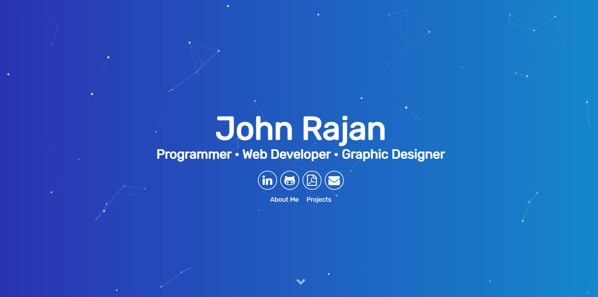

# <a href="https://people.umass.edu/avsingh" target="_blank">John Rajan Portfolio Website</a>

 
This website serves as an online portfolio to showcase my web presence, résumé, story, & featured projects with a Particle.js aligned theme. It was generated using using Jekyll, Sass, and Gulp.js.

Please hit me up at tiger773131@gmail.com if you have any feedback or ideas for the website. Leave a :star: &nbsp;if you like it!
